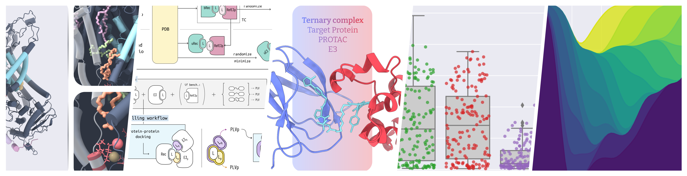

## Hi there 👋

I am Paula, a PhD student at the University of Waterloo, Chemistry. I work with computational structural biology, including software development for drug discovery and molecular modelling and dynamics.
I am also passionate about developing visual designs for clear and compelling communication of complex science.

- I am currently working on PROTAC drug discovery
- Check out [my portfolio](https://kaput-flood-25b.notion.site/Paula-Jofily-420afc31678f408aa5958459494a1c07)!

<!--
**PaulaJLR/PaulaJLR** is a ✨ _special_ ✨ repository because its `README.md` (this file) appears on your GitHub profile.

Here are some ideas to get you started:

- 🔭 I’m currently working on ...
- 🌱 I’m currently learning ...
- 👯 I’m looking to collaborate on ...
- 🤔 I’m looking for help with ...
- 💬 Ask me about ...
- 📫 How to reach me: ...
- 😄 Pronouns: ...
- ⚡ Fun fact: ...
-->
