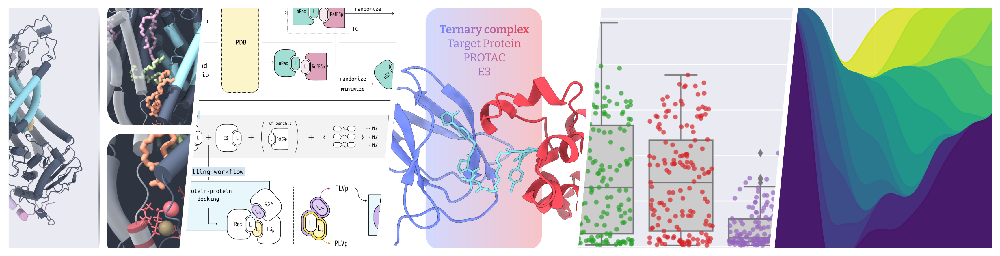

## Hi there 👋

I am Paula, a software developer and computational structural biologist based in Toronto.

### Recent Open-Source Projects
- [P4ward](https://github.com/skteamlab/p4ward) — An automated pipeline for PROTAC ternary complex modelling.
- [MDProtocols](https://github.com/paulajlr/mdprotocols) — An object-oriented Python framework for truly gentle MD equilibration using OpenMM.

---
*I am also passionate about developing visual designs for clear and compelling communication of complex science. Check out [my visual portfolio](https://kaput-flood-25b.notion.site/?v=662cf8737a8540da8d639633bd5424c9)!*
